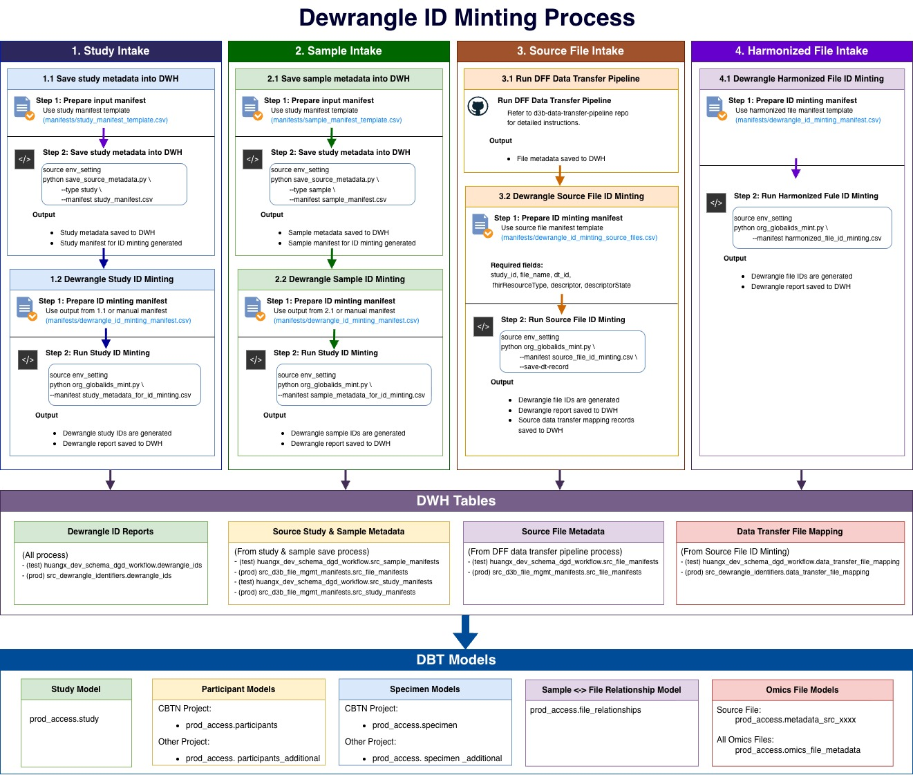

# Dewrangle ID Minting Process

End-to-end workflows for minting Dewrangle global IDs and managing study / sample / file metadata across:

- **CBTN projects**
- **D3b non-CBTN projects**
- **Kids First & INCLUDE projects**

Supported workflows:
- Source metadata intake into the Data Warehouse (DWH)
- Dewrangle global ID minting (org-level)
- Dewrangle study creation and persistence (KF/INCLUDE)
- Global ID check & update (query / upsert specific records)
- Source file & harmonized file registration

---
## Data Flow Overview



## Installation

### 1. Clone the repository
```bash
git clone git@github.com:d3b-center/dewrangle-id-minting-process.git
cd dewrangle-id-minting-process
```

### 2. Create a virtual environment (recommended)
```bash
python -m venv venv
source venv/bin/activate
```

### 3. Install the `d3b-dewrangle` CLI and dependencies

```bash
make install
```

This installs all dependencies from `requirements.txt` and registers the `d3b-dewrangle` console script via `pyproject.toml`.

Or manually with `pip`:
```bash
pip install -r requirements.txt
pip install -e .
```

Verify the command is available:
```bash
d3b-dewrangle --help
```
---

## Configuration

All credentials and environment-specific settings are loaded from **`configs/env_setting`**.

### Required environment variables

| Variable | Description |
|----------|-------------|
| `DEWRANGLE_TOKEN` | Dewrangle API key |
| `DEWRANGLE_BASE_URL` | Dewrangle base URL (e.g. `https://dewrangle.com/`) |
| `D3B_WAREHOUSE_DB_USER` / `D3B_WAREHOUSE_DB_USER_PW` | D3b DWH credentials |
| `DCC_WAREHOUSE_DB_USER` / `DCC_WAREHOUSE_DB_USER_PW` | DCC DWH credentials |

### Optional overrides

| Variable | Description |
|----------|-------------|
| `D3B_WAREHOUSE_HOST` / `D3B_WAREHOUSE_PORT` / `D3B_WAREHOUSE_DB_NAME` | D3b DWH connection details |
| `DCC_WAREHOUSE_HOST` / `DCC_WAREHOUSE_PORT` / `DCC_WAREHOUSE_DB_NAME` | DCC DWH connection details |

### Load configuration before every run

```bash
source configs/env_setting
```
---

## Quick Start (Unified CLI)

The fastest way to run any workflow is through the unified `d3b-dewrangle` CLI:

```bash
d3b-dewrangle <subcommand> [options]
```

| Subcommand | What it does | Example |
|------------|--------------|---------|
| `source-intake` | Ingest study / sample metadata into the DWH | `d3b-dewrangle source-intake --env qa --db d3b --type study --manifest manifests/study_intake_manifest.csv` |
| `global-id-mint` | Mint org-level global IDs from a manifest and save its record into DWH| `d3b-dewrangle global-id-mint --env qa --db d3b --manifest manifests/dewrangle_id_minting_manifest.csv` |
| `global-id-check` | Query a specific global ID and download its record | `d3b-dewrangle global-id-check --env qa --id sd-xxxxxx` |
| `global-id-update` | Update specific global ID records from a manifest and update its record in the DWH| `d3b-dewrangle global-id-update --env qa --db d3b --manifest manifests/dewrangle_id_update_manifest.csv` |
| `study-create` | Create a Kids First study in Dewrangle and save its record into DWH| `d3b-dewrangle study-create --env qa --db dcc --study-name "My Study"` |
| `cbtn-prepare` | Validate CBTN data and prepare minting manifest | `d3b-dewrangle cbtn-prepare --manifest manifests/cbtn_sample_participants.csv --type both` |

### Get help for any subcommand
```bash
d3b-dewrangle --help
d3b-dewrangle global-id-mint --help
d3b-dewrangle global-id-update --help
```

### Common arguments

| Argument | Choices | Description |
|----------|---------|-------------|
| `--env` | `prod`, `qa` | Determines default Dewrangle organization and DWH target schema |
| `--db` | `d3b`, `dcc` | Database warehouse type |
| `--manifest` | file path | Path to input CSV manifest |
| `--organization-id` | string | Override default Dewrangle organization ID |
| `--output-dir` | directory | Directory to save downloaded CSV reports |
| `--save-dt-record` | flag | Save data transfer mapping record to DWH (source files only) |

---

## Workflow Guides

### 1. CBTN Sample ID Minting

Designed for CBTN projects where participant and specimen metadata already exist in the D3b DWH (`prod_access.participants`, `prod_access.specimen`).

#### Step 1 — Prepare input manifest

Use the template: [`manifests/cbtn_sample_participants.csv`](manifests/cbtn_sample_participants.csv)

| Minting Type | Required Fields |
|---|---|
| Participant ID | `case_id` |
| Specimen ID | `sample_id`, `aliquot_id` |
| Both | `case_id`, `sample_id`, `aliquot_id` |

#### Step 2 — Validate and prepare minting manifest

```bash
d3b-dewrangle cbtn-prepare \
    --manifest manifests/cbtn_sample_participants.csv \
    --type both
```

Outputs:
- `cbtn_participants_specimens_to_mint.csv` → ready for ID minting
- `cbtn_participants_specimens_minted_in_dwh.csv` → already minted
- `cbtn_participants_missing_in_dwh.csv` → `case_id` not found
- `cbtn_specimens_missing_in_dwh.csv` → `sample_id` / `aliquot_id` not found

#### Step 3 — Mint IDs

```bash
d3b-dewrangle global-id-mint \
    --env qa --db d3b \
    --manifest cbtn_participants_specimens_to_mint.csv
```

**Output:**
- Dewrangle IDs generated
- Report saved to DWH (test → `huangx_dev_schema_dgd_workflow.dewrangle_ids`, prod → `src_dewrangle_identifiers.dewrangle_ids`)

---

### 2. D3b Non-CBTN Project Intake

For other D3b-managed projects that require metadata ingestion before ID minting.

#### 2.1 Study Intake

**Step 1 — Prepare study manifest** 
Use the template [`manifests/study_manifest_template.csv`](manifests/study_manifest_template.csv)

Required fields: `study_name`, `program`

**Step 2 — Ingest into DWH**

```bash
d3b-dewrangle source-intake \
    --env qa --db d3b \
    --type study \
    --manifest manifests/study_intake_manifest.csv
```

This generates `study_metadata_for_id_minting.csv` if studies are not yet minted.

**Step 3 — Mint study IDs**

```bash
d3b-dewrangle global-id-mint \
    --env qa --db d3b \
    --manifest study_metadata_for_id_minting.csv
```

Use `fhirResourceType = 'ResearchStudy'` in the manifest.

#### 2.2 Sample Intake

**Step 1 — Prepare sample manifest**
Use the template [`manifests/sample_manifest_template.csv`](manifests/sample_manifest_template.csv)

Required fields: `study_id`, `case_id`, `sample_id`, `aliquot_id`

**Step 2 — Ingest into DWH**

```bash
d3b-dewrangle source-intake \
    --env qa --db d3b \
    --type sample \
    --manifest manifests/sample_intake_manifest.csv
```

This generates `sample_metadata_for_id_minting.csv`.

**Step 3 — Mint sample IDs**

```bash
d3b-dewrangle global-id-mint \
    --env qa --db d3b \
    --manifest sample_metadata_for_id_minting.csv
```

Manifest tips:
- **Participant:** `fhirResourceType = 'Patient'`, `descriptor = case_id;study_id`
- **Biospecimen:** `fhirResourceType = 'Specimen'`, `descriptor = aliquot_id;study_id`

> **⚠️ Important:** Always include `study_id` in the descriptor to disambiguate records across studies.

---

### 3. Kids First & INCLUDE Project Intake

For KF/INCLUDE projects using the DCC DWH.

#### 3.1 Study Create
Creates a real study entity in Dewrangle and persists its global-descriptors report to the DWH.

```bash
d3b-dewrangle study-create \
    --env qa --db dcc \
    --study-name "My Study Name"
```

Functionality:
1. Query Dewrangle API to check if this study already exist. And check if this study alreay exist in the DWH,
2. If yes + in DWH → nothing to do
3. If yes + missing from DWH → download report and save
4. If no → create study → download report → save to DWH
5. 
#### 3.2 Sample ID Minting

**Step 1 — Prepare sample manifest**

Refer to the example manifest [`manifests/dewrangle_id_minting_manifest.csv`](manifests/dewrangle_id_minting_manifest.csv)

Manifest tips:
- **Participant:** `fhirResourceType = 'Patient'`, `descriptor = case_id;study_id`
- **Biospecimen:** `fhirResourceType = 'Specimen'`, `descriptor = aliquot_id;study_id`

**Step 2 — Mint sample IDs**

```bash
d3b-dewrangle global-id-mint \
    --env qa --db dcc \
    --manifest manifests/dewrangle_id_minting_manifest.csv
```
---

### 5. File Intake (All Projects)

All file metadata is stored in the **D3b DWH**, regardless of project type.

#### 5.1 Source File Intake

**Step 1 — Run the DFF Data Transfer Pipeline**
- See [d3b-data-transfer-pipeline](https://github.com/d3b-center/d3b-data-transfer-pipeline) for instructions.

**Step 2 — Mint source file IDs**

Prepare a manifest using [`manifests/dewrangle_id_minting_source_files.csv`](manifests/dewrangle_id_minting_source_files.csv)

Required fields: `study_id`, `file_name`, `dt_id`, `fhirResourceType`, `descriptor`, `descriptorState`

```bash
d3b-dewrangle global-id-mint \
    --env qa --db d3b \
    --save-dt-record \
    --manifest test_data/source_file_metadata_for_id_minting.csv
```

**Output:**
- Dewrangle file IDs generated
- Report saved to DWH (`dewrangle_ids` table)
- Data transfer mapping saved to DWH (`data_transfer_file_mapping` table)

#### 5.2 Harmonized File Intake

Prepare a manifest using [`manifests/dewrangle_id_minting_manifest.csv`](manifests/dewrangle_id_minting_manifest.csv)
- `fhirResourceType = 'DocumentReference'`

```bash
d3b-dewrangle global-id-mint \
    --env qa --db d3b \
    --manifest harmonized_file_id_minting.csv
```

---

## Global ID Check & Update

### Check a specific global ID

Query Dewrangle for a single global ID and download its full record (study, descriptors, timestamps, creators).

```bash
d3b-dewrangle global-id-check \
    --env qa \
    --id sd-xxxxxx
```

**Output CSV columns:**
- `globalId`, `studyGlobalId`, `studyName`
- `fhirResourceType`, `descriptor`, `descriptorState`
- `globalIdCreatedAt`, `globalIdCreatedBy`
- `descriptorCreatedAt`, `descriptorCreatedBy`

### Update specific global ID records

Upload a manifest containing the global IDs to update, trigger an upsert in Dewrangle, then replace the corresponding records in the DWH.

**Required manifest columns:**
- `globalId`, `fhirResourceType`, `descriptor`, `descriptorState`

**Optional:** `studyGlobalId`, `studyName`

```bash
d3b-dewrangle global-id-update \
    --env qa --db d3b \
    --manifest global_id_update.csv
```

**Behavior:**
1. Upload manifest → trigger Dewrangle `globalIdentifierUpsert`
2. Download **filtered** organization global identifiers (only the globalIds from your manifest)
3. Delete existing DB records for those globalIds
4. Insert the freshly downloaded records into the DWH

---

